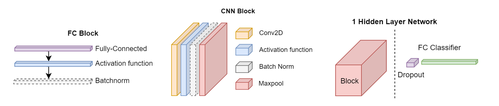

# SoftHebb
_This open source project is not an official Huawei product. Huawei is not expected to provide support for this project._
### Hebbian Deep Learning Without Feedback (ICLR 2023)

This repository reproduces the experiments of [this ICLR 2023 paper](https://openreview.net/forum?id=8gd4M-_Rj1), which has been accepted as Notable Top-25.

_Authors:_ Adrien Journé, Hector Garcia Rodriguez, Qinghai Guo, Timoleon Moraitis

_Keywords:_ Hebbian, winner-take-all, cortical circuits, unsupervised, online, biologically plausible, neuromorphic

_TL;DR:_ Advancing the state of the art in bio-plausible Deep Learning, and the plausibility of DL, through Hebbian plasticity and soft winner-take-all nets.

### Bayesian inference in unsupervised Hebbian soft winner-take-all networks (Neuromorph. Comput. Eng. 2022)
The repo also follows from [this journal paper](https://iopscience.iop.org/article/10.1088/2634-4386/aca710) (Neuromorphic Computing and Engineering 2022), which has been selected as one of [the journal's top papers for 2022](https://iopscience.iop.org/journal/2634-4386/page/2022_Highlights).

_Authors:_ Timoleon Moraitis, Dmitry Toichkin, Adrien Journé, Yansong Chua, Qinghai Guo

_TL;DR:_ Theoretical derivation of competitive Hebbian learning rule that minimizes cross-entropy without access to labels; demonstrations of its fast learning, robustness to noise and adversarial attacks.

## Abstract (ICLR 2023 - Multilayer learning)
Recent approximations to backpropagation (BP) have mitigated many of BP's computational inefficiencies and incompatibilities with biology, but important limitations still remain. Moreover, the approximations significantly decrease accuracy in benchmarks, suggesting that an entirely different approach may be more fruitful. Here, grounded on [recent theory for Hebbian learning in soft winner-take-all networks](https://iopscience.iop.org/article/10.1088/2634-4386/aca710), we present multilayer SoftHebb, i.e. an algorithm that trains deep neural networks, without any feedback, target, or error signals. As a result, it achieves efficiency by avoiding weight transport, non-local plasticity, time-locking of layer updates, iterative equilibria, and (self-) supervisory or other feedback signals – which were necessary in other approaches. Its increased efficiency and biological compatibility do not trade off accuracy compared to state-of-the-art bio-plausible learning, but rather improve it. With up to five hidden layers and an added linear classifier, accuracies on MNIST, CIFAR-10, STL-10, and ImageNet, respectively reach 99.4%, 80.3%, 76.2%, and 27.3%. In conclusion, SoftHebb shows with a radically different approach from BP that Deep Learning over few layers may be plausible in the brain and increases the accuracy of bio-plausible machine learning. Code is available at https://github.com/NeuromorphicComputing/SoftHebb.

## Abstract (Neuromorph. Comput. Eng. 2022 - Theoretical derivations & demonstrations of adversarial robustness)
Hebbian plasticity in winner-take-all (WTA) networks is highly attractive for neuromorphic on-chip learning, owing to its efficient, local, unsupervised, and on-line nature. Moreover, its biological plausibility may help overcome important limitations of artificial algorithms, such as their susceptibility to adversarial attacks, and their high demands for training-example quantity and repetition. However, Hebbian WTA learning has found little use in machine learning, likely because it has been missing an optimization theory compatible with deep learning (DL). Here we show rigorously that WTA networks constructed by standard DL elements, combined with a Hebbian-like plasticity that we derive, maintain a Bayesian generative model of the data. Importantly, without any supervision, our algorithm, SoftHebb, minimizes cross-entropy, i.e. a common loss function in supervised DL. We show this theoretically and in practice. The key is a 'soft' WTA where there is no absolute 'hard' winner neuron. Strikingly, in shallow-network comparisons with backpropagation, SoftHebb shows advantages beyond its Hebbian efficiency. Namely, it converges in fewer iterations, and is significantly more robust to noise and adversarial attacks. Notably, attacks that maximally confuse SoftHebb are also confusing to the human eye, potentially linking human perceptual robustness, with Hebbian WTA circuits of cortex. Finally, SoftHebb can generate synthetic objects as interpolations of real object classes. All in all, Hebbian efficiency, theoretical underpinning, cross-entropy-minimization, and surprising empirical advantages, suggest that SoftHebb may inspire highly neuromorphic and radically different, but practical and advantageous learning algorithms and hardware accelerators.

## Cite
To cite this work please use the following citations:

    @inproceedings{
      journe2023hebbian,
      title={Hebbian Deep Learning Without Feedback},
      author={Adrien Journ{\'e} and Hector Garcia Rodriguez and Qinghai Guo and Timoleon Moraitis},
      booktitle={The Eleventh International Conference on Learning Representations },
      year={2023},
      url={https://openreview.net/forum?id=8gd4M-_Rj1}
      }

    @article{moraitis2022softhebb,
      title={SoftHebb: Bayesian inference in unsupervised Hebbian soft winner-take-all networks},
      author={Moraitis, Timoleon and Toichkin, Dmitry and Journ{\'e}, Adrien and Chua, Yansong and Guo, Qinghai},
      journal={Neuromorphic Computing and Engineering},
      volume={2},
      number={4},
      pages={044017},
      year={2022},
      publisher={IOP Publishing}
    }

## Quick start
    # Install and activate base anaconda environment
    conda env create -n softhebb -f environment_pytorch==1.7.1.yml
    conda activate softhebb

    # Train a ConvNet using SoftHebb and evaluate with a linear classifier, on CIFAR10
    python demo.py

### Troubleshoot
- Make sure pytorch for cuda is installed, specify build if the cpu version is installed by default (can't be upgraded): 
    
    conda install pytorch==1.7.1 torchvision=0.8.2=py38_cu101 torchaudio==0.7.2 cudatoolkit=10.1 -c pytorch
    
- One might have to create env first with the specific python version (3.8.11), install torch (as mentioned before, or specify build in case it defaults to cpu version), and then rest of dependencies.

## Commands to reproduce experiments in the ICLR 2023 paper
Before running experiments:
- Make sure conda environment is [installed](#quick-start) and [working](#troubleshoot)
- Set data path, as explained [here](#set-data-path)

All figures can be generated using graphs.ipynb, where there are more instructions.
Below you can find the commands to train the models and evaluate them in order to obtain the results for the graphs. The Hebbian layers are trained successively (greedily), as is reported in the paper. However, we have found that training these simultaneously (--training-mode consecutive) generally does not hurt performance or might be even better, while shortening training time.

### Figure 1
- Train SoftHebb networks with different depth on CIFAR10. If you have run the experiments to plot Figure 3 or 4, you can skip these commands. The following commands launch 4 experiments with different random initialisations:
  - 1 layer SoftHebb: `python ray_search.py --preset 2SoftHebbCnnCIFAR --dataset-unsup CIFAR10_1 --dataset-sup CIFAR10_50 --folder-name 'CIFAR10_SoftHebb2' --save-model`
  - 2 layer SoftHebb: `python ray_search.py --preset 3SoftHebbCnnCIFAR --dataset-unsup CIFAR10_1 --dataset-sup CIFAR10_50 --folder-name 'CIFAR10_SoftHebb3' --save-model`
  - 3 layer SoftHebb: `python ray_search.py --preset 4SoftHebbCnnCIFAR --dataset-unsup CIFAR10_1 --dataset-sup CIFAR10_50 --folder-name 'CIFAR10_SoftHebb4' --save-model` 

### Figure 2
1. Train 4-layer network with on STL-10. If you have run the experiments to plot Figure 3 or 5 you can skip these commands: 
  - `python ray_search.py --preset 5SoftHebbCnnSTL --dataset-unsup STL10_unlabel --dataset-sup STL10_100aug --save-model`

### Figure 3
To train the different models in the datasets:
- CIFAR10
  - SoftHebb (if you have run the experiments for Figure 1 or 4, you can skip these commands)
    - 1 layer: `python ray_search.py --preset 2SoftHebbCnnCIFAR --dataset-unsup CIFAR10_1 --dataset-sup CIFAR10_50 --folder-name 'CIFAR10_SoftHebb2' --save-model`
    - 2 layer: `python ray_search.py --preset 3SoftHebbCnnCIFAR --dataset-unsup CIFAR10_1 --dataset-sup CIFAR10_50 --folder-name 'CIFAR10_SoftHebb3' --save-model`
    - 3 layer: `python ray_search.py --preset 4SoftHebbCnnCIFAR --dataset-unsup CIFAR10_1 --dataset-sup CIFAR10_50 --folder-name 'CIFAR10_SoftHebb4' --save-model`
  - Hard-WTA
    - 1 layer: `python ray_search.py --preset 2HardCnnCIFAR --dataset-unsup CIFAR10_1 --dataset-sup CIFAR10_50 --folder-name 'CIFAR10_HardWTA2' --save-model`
    - 2 layer: `python ray_search.py --preset 3HardCnnCIFAR --dataset-unsup CIFAR10_1 --dataset-sup CIFAR10_50 --folder-name 'CIFAR10_HardWTA3' --save-model`
    - 3 layer: `python ray_search.py --preset 4HardCnnCIFAR --dataset-unsup CIFAR10_1 --dataset-sup CIFAR10_50 --folder-name 'CIFAR10_HardWTA4' --save-model`
  - Random
    - 1 layer: `python ray_search.py --preset 2SoftHebbCnnCIFAR --dataset-sup CIFAR10_50 --training-blocks 1 --folder-name 'CIFAR10_Random2' --save-model`
    - 2 layer: `python ray_search.py --preset 3SoftHebbCnnCIFAR --dataset-sup CIFAR10_50 --training-blocks 2 --folder-name 'CIFAR10_Random3' --save-model`
    - 3 layer: `python ray_search.py --preset 4SoftHebbCnnCIFAR --dataset-sup CIFAR10_50 --training-blocks 3 --folder-name 'CIFAR10_Random4' --save-model`
  - BP
    - 1 layer: `python ray_search.py --preset 2CnnCIFAR --dataset-sup CIFAR10_50 --folder-name 'CIFAR10_BP2' --save-model`
    - 2 layer: `python ray_search.py --preset 3CnnCIFAR --dataset-sup CIFAR10_50 --folder-name 'CIFAR10_BP3' --save-model`
    - 3 layer: `python ray_search.py --preset 4CnnCIFAR --dataset-sup CIFAR10_50 --folder-name 'CIFAR10_BP4' --save-model`
- CIFAR100
  - SoftHebb
    - 1 layer: `python ray_search.py --preset 2SoftHebbCnnCIFAR --dataset-unsup CIFAR100_1 --dataset-sup CIFAR100_50 --folder-name 'CIFAR100_SoftHebb2' --save-model`
    - 2 layer: `python ray_search.py --preset 3SoftHebbCnnCIFAR --dataset-unsup CIFAR100_1 --dataset-sup CIFAR100_50 --folder-name 'CIFAR100_SoftHebb3' --save-model`
    - 3 layer: `python ray_search.py --preset 4SoftHebbCnnCIFAR --dataset-unsup CIFAR100_1 --dataset-sup CIFAR100_50 --folder-name 'CIFAR100_SoftHebb4' --save-model`
  - Hard-WTA
    - 1 layer: `python ray_search.py --preset 2HardCnnCIFAR --dataset-unsup CIFAR100_1 --dataset-sup CIFAR100_50 --folder-name 'CIFAR100_HardWTA2' --save-model`
    - 2 layer: `python ray_search.py --preset 3HardCnnCIFAR --dataset-unsup CIFAR100_1 --dataset-sup CIFAR100_50 --folder-name 'CIFAR100_HardWTA3' --save-model`
    - 3 layer: `python ray_search.py --preset 4HardCnnCIFAR --dataset-unsup CIFAR100_1 --dataset-sup CIFAR100_50 --folder-name 'CIFAR100_HardWTA4' --save-model`
  - Random
    - 1 layer: `python ray_search.py --preset 2SoftHebbCnnCIFAR --dataset-sup CIFAR100_50 --training-blocks 1 --folder-name 'CIFAR100_Random2' --save-model`
    - 2 layer: `python ray_search.py --preset 3SoftHebbCnnCIFAR --dataset-sup CIFAR100_50 --training-blocks 2 --folder-name 'CIFAR100_Random3' --save-model`
    - 3 layer: `python ray_search.py --preset 4SoftHebbCnnCIFAR --dataset-sup CIFAR100_50 --training-blocks 3 --folder-name 'CIFAR100_Random4' --save-model`
  - BP
    - 1 layer: `python ray_search.py --preset 2CnnCIFAR --dataset-sup CIFAR100_50 --folder-name 'CIFAR100_BP2' --save-model`
    - 2 layer: `python ray_search.py --preset 3CnnCIFAR --dataset-sup CIFAR100_50 --folder-name 'CIFAR100_BP3' --save-model`
    - 3 layer: `python ray_search.py --preset 4CnnCIFAR --dataset-sup CIFAR100_50 --folder-name 'CIFAR100_BP4' --save-model`
- STL10
  - SoftHebb
    - 1 layer: `python ray_search.py --preset 2SoftHebbCnnCIFAR --dataset-unsup STL10_unlabel --dataset-sup STL10_100aug --folder-name 'STL10_SoftHebb2' --save-model`
    - 2 layer: `python ray_search.py --preset 3SoftHebbCnnCIFAR --dataset-unsup STL10_unlabel --dataset-sup STL10_100aug --folder-name 'STL10_SoftHebb3' --save-model`
    - 3 layer: `python ray_search.py --preset 4SoftHebbCnnSTL --dataset-unsup STL10_unlabel --dataset-sup STL10_100aug --folder-name 'STL10_SoftHebb4' --save-model`
    - 4 layer (if you have run the experiments for Figure 2 or 5, you can skip this command): `python ray_search.py --preset 5SoftHebbCnnSTL --dataset-unsup STL10_unlabel --dataset-sup STL10_100aug --folder-name 'STL10_SoftHebb5' --save-model`
  - Hard-WTA
    - 1 layer: `python ray_search.py --preset 2HardCnnCIFAR --dataset-unsup STL10_unlabel --dataset-sup STL10_100aug --folder-name 'STL10_HardWTA2' --save-model`
    - 2 layer: `python ray_search.py --preset 3HardCnnCIFAR --dataset-unsup STL10_unlabel --dataset-sup STL10_100aug --folder-name 'STL10_HardWTA3' --save-model`
    - 3 layer: `python ray_search.py --preset 4HardCnnCIFAR --dataset-unsup STL10_unlabel --dataset-sup STL10_100aug --folder-name 'STL10_HardWTA4' --save-model`
    - 4 layer: `python ray_search.py --preset 5HardCnnSTL --dataset-unsup STL10_unlabel --dataset-sup STL10_100aug --folder-name 'STL10_HardWTA5' --save-model`
  - Random
    - 1 layer: `python ray_search.py --preset 2SoftHebbCnnCIFAR --dataset-sup STL10_100aug --training-blocks 1 --folder-name 'STL10_Random2' --save-model`
    - 2 layer: `python ray_search.py --preset 3SoftHebbCnnCIFAR --dataset-sup STL10_100aug --training-blocks 2 --folder-name 'STL10_Random3' --save-model`
    - 3 layer: `python ray_search.py --preset 4SoftHebbCnnSTL --dataset-sup STL10_100aug --training-blocks 3 --folder-name 'STL10_Random4' --save-model`
    - 4 layer: `python ray_search.py --preset 5SoftHebbCnnSTL --dataset-sup STL10_100aug --training-blocks 4 --folder-name 'STL10_Random5' --save-model`
  - BP
    - 1 layer: `python ray_search.py --preset 2CnnCIFAR --dataset-sup STL10_100aug --folder-name 'STL10_BP2' --save-model`
    - 2 layer: `python ray_search.py --preset 3CnnCIFAR --dataset-sup STL10_100aug --folder-name 'STL10_BP3' --save-model`
    - 3 layer: `python ray_search.py --preset 4CnnSTL --dataset-sup STL10_100aug --folder-name 'STL10_BP4' --save-model`
    - 4 layer: `python ray_search.py --preset 5CnnSTL --dataset-sup STL10_100aug --folder-name 'STL10_BP5' --save-model`
- ImageNette
  - SoftHebb
    - 1 layer: `python ray_search.py --preset 2SoftHebbCnnCIFAR --dataset-unsup ImageNette_1 --dataset-sup ImageNette_200aug --folder-name 'ImageNette_SoftHebb2' --save-model`
    - 2 layer: `python ray_search.py --preset 3SoftHebbCnnCIFAR --dataset-unsup ImageNette_1 --dataset-sup ImageNette_200aug --folder-name 'ImageNette_SoftHebb3' --save-model`
    - 3 layer: `python ray_search.py --preset 4SoftHebbCnnCIFAR --dataset-unsup ImageNette_1 --dataset-sup ImageNette_200aug --folder-name 'ImageNette_SoftHebb4' --save-model`
    - 4 layer: `python ray_search.py --preset 5SoftHebbCnnSTL --dataset-unsup ImageNette_1 --dataset-sup ImageNette_200aug --folder-name 'ImageNette_SoftHebb5' --save-model`
    - 5 layer: `python ray_search.py --preset 6SoftHebbCnnImNet --dataset-unsup ImageNette_1 --dataset-sup ImageNette_200aug --folder-name 'ImageNette_SoftHebb6' --save-model`
  - Hard-WTA
    - 1 layer: `python ray_search.py --preset 2HardCnnImNet --dataset-unsup ImageNette_1 --dataset-sup ImageNette_200aug --folder-name 'ImageNette_HardWTA2' --save-model`
    - 2 layer: `python ray_search.py --preset 3HardCnnImNet --dataset-unsup ImageNette_1 --dataset-sup ImageNette_200aug --folder-name 'ImageNette_HardWTA3' --save-model`
    - 3 layer: `python ray_search.py --preset 4HardCnnImNet --dataset-unsup ImageNette_1 --dataset-sup ImageNette_200aug --folder-name 'ImageNette_HardWTA4' --save-model`
    - 4 layer: `python ray_search.py --preset 5HardCnnImNet --dataset-unsup ImageNette_1 --dataset-sup ImageNette_200aug --folder-name 'ImageNette_HardWTA5' --save-model`
    - 5 layer: `python ray_search.py --preset 6HardCnnImNet --dataset-unsup ImageNette_1 --dataset-sup ImageNette_200aug --folder-name 'ImageNette_HardWTA6' --save-model`
  - Random
    - 1 layer: `python ray_search.py --preset 2SoftHebbCnnImNet --dataset-sup ImageNette_200aug --training-blocks 1 --folder-name 'ImageNette_Random2' --save-model`
    - 2 layer: `python ray_search.py --preset 3SoftHebbCnnImNet --dataset-sup ImageNette_200aug --training-blocks 2 --folder-name 'ImageNette_Random3' --save-model`
    - 3 layer: `python ray_search.py --preset 4SoftHebbCnnImNet --dataset-sup ImageNette_200aug --training-blocks 3 --folder-name 'ImageNette_Random4' --save-model`
    - 4 layer: `python ray_search.py --preset 5SoftHebbCnnImNet --dataset-sup ImageNette_200aug --training-blocks 4 --folder-name 'ImageNette_Random5' --save-model`
    - 5 layer: `python ray_search.py --preset 6SoftHebbCnnImNet --dataset-sup ImageNette_200aug --training-blocks 5 --folder-name 'ImageNette_Random6' --save-model`
  - BP
    - 1 layer: `python ray_search.py --preset 2CnnImNet --dataset-sup ImageNette_200aug --folder-name 'ImageNette_BP2' --save-model`
    - 2 layer: `python ray_search.py --preset 3CnnImNet --dataset-sup ImageNette_200aug --folder-name 'ImageNette_BP3' --save-model`
    - 3 layer: `python ray_search.py --preset 4CnnImNet --dataset-sup ImageNette_200aug --folder-name 'ImageNette_BP4' --save-model`
    - 4 layer: `python ray_search.py --preset 5CnnImNet --dataset-sup ImageNette_200aug --folder-name 'ImageNette_BP5' --save-model`
    - 5 layer: `python ray_search.py --preset 6CnnImNet --dataset-sup ImageNette_200aug --folder-name 'ImageNette_BP6' --save-model`

### Figure 4
Run the experiments:
- width ratio of 1
  - 2 layer SoftHebb: `python ray_search.py --preset 3SoftHebbCnnCIFAR_wf1 --dataset-unsup CIFAR10_1 --dataset-sup CIFAR10_50 --folder-name 'CIFAR10_SoftHebb3_wf1' --save-model`
  - 3 layer SoftHebb: `python ray_search.py --preset 4SoftHebbCnnCIFAR_wf1 --dataset-unsup CIFAR10_1 --dataset-sup CIFAR10_50 --folder-name 'CIFAR10_SoftHebb4_wf1' --save-model`
- width ratio of 2
  - 2 layer SoftHebb: `python ray_search.py --preset 3SoftHebbCnnCIFAR_wf2 --dataset-unsup CIFAR10_1 --dataset-sup CIFAR10_50 --folder-name 'CIFAR10_SoftHebb3_wf2' --save-model`
  - 3 layer SoftHebb: `python ray_search.py --preset 4SoftHebbCnnCIFAR_wf2 --dataset-unsup CIFAR10_1 --dataset-sup CIFAR10_50 --folder-name 'CIFAR10_SoftHebb4_wf2' --save-model`
- Width ratio of 4 (If you generated figures 1 or 3, you don't need to re-run these)
  - 1 layer SoftHebb: `python ray_search.py --preset 2SoftHebbCnnCIFAR --dataset-unsup CIFAR10_1 --dataset-sup CIFAR10_50 --folder-name 'CIFAR10_SoftHebb2' --save-model`
  - 2 layer SoftHebb: `python ray_search.py --preset 3SoftHebbCnnCIFAR --dataset-unsup CIFAR10_1 --dataset-sup CIFAR10_50 --folder-name 'CIFAR10_SoftHebb3' --save-model`
  - 3 layer SoftHebb: `python ray_search.py --preset 4SoftHebbCnnCIFAR --dataset-unsup CIFAR10_1 --dataset-sup CIFAR10_50 --folder-name 'CIFAR10_SoftHebb4' --save-model`

### Figure 5
- To get the STL-10 model (if you have run the experiments for Figure 2 or 3, you can skip this command): 
  - `python multi_layer.py --preset 5SoftHebbCnnSTL --dataset-unsup STL10_unlabel --dataset-sup STL10_100aug --model-name STL10_SoftHebb5 --save-model`

### Table 1
- Obtain 4 seeds for each:
  - 3 layer SoftHebb (if you have run the experiments for Figure 1, 3 or 4, you can skip this command): `python ray_search.py --preset 4SoftHebbCnnCIFAR --dataset-unsup CIFAR10_1 --dataset-sup CIFAR10_50  --folder-name 'CIFAR10_SoftHebb4' --save-model`
  - 3 layer BP: `python ray_search.py --preset 4CnnCIFAR --dataset-sup CIFAR10_50 --folder-name 'CIFAR10_BP4' --save-model`

### Table 2
- STL-10
  - 4 layer SoftHebb (if you have run the experiments for Figure 2, 3 or 5, you can skip this command): `python ray_search.py --preset 5SoftHebbCnnSTL --dataset-unsup STL10_unlabel --dataset-sup STL10_100aug --folder-name 'STL10_SoftHebb5' --save-model`
  - 4 layer Random (if you have run the experiments for Figure 3, you can skip this command): `python ray_search.py --preset 5SoftHebbCnnSTL --dataset-sup STL10_100aug --training-blocks 4 --folder-name 'STL10_Random5' --save-model`
  - 4 layer Hard WTA (if you have run the experiments for Figure 3, you can skip this command): `python ray_search.py --preset 5HardCnnSTL --dataset-unsup STL10_unlabel --dataset-sup STL10_100aug --folder-name 'STL10_HardWTA5' --save-model`
- ImageNet
  - SoftHebb: `python ray_search.py --preset 6SoftHebbCnnImNet --dataset-unsup ImageNet_1160 --dataset-sup ImageNet_200aug160 --config one_seed --folder-name ImageNet_SoftHebb6 --save-model`
  - Hard-WTA: `python ray_search.py --preset 6HardCnnImNet --dataset-unsup ImageNet_1160 --dataset-sup ImageNet_200aug160 --config one_seed --folder-name ImageNet_HardWTA6 --save-model`
  - BP: `python ray_search.py --preset 6CnnImNet --dataset-unsup ImageNet_1160 --dataset-sup ImageNet_200aug160 --config one_seed --folder-name ImageNet_BP6 --save-model`

### B.1
Accuracy vs temperature
  - `python ray_search.py --preset 2SoftHebbCnnCIFAR --dataset-unsup CIFAR10_1 --dataset-sup CIFAR10_50 --config regimes --folder-name SoftHebb2_regimes_multilayer`

### B.2
Accuracy vs temperature
- `python ray_search.py --preset 4SoftHebbCnnCIFAR --dataset-unsup CIFAR10_1 --dataset-sup CIFAR10_50 --config regimes --folder-name SoftHebb4_regimes_multilayer`

### B.3
- A. (formerly B.3)
  - linear decay: `python ray_search.py --preset 2SoftMlpMNIST_linearDecay --dataset-unsup MNIST_1-32 --dataset-sup MNIST_10 --config radius --folder-name InitRadiusLinearDecay`
  - radius dependent: `python ray_search.py --preset 2SoftMlpMNIST --dataset-unsup MNIST_1-32 --dataset-sup MNIST_10 --config radius --folder-name InitRadiusNormDecay`
  - linear decay: `python multi_layer.py --preset 2SoftMlpMNIST_linearDecay --dataset-unsup MNIST_1-32 --dataset-sup MNIST_10 --model-name InitRadiusLinearDecay`
  - radius dependent: `python multi_layer.py --preset 2SoftMlpMNIST --dataset-unsup MNIST_1-32 --dataset-sup MNIST_10 --model-name InitRadiusNormDecay`
- B. (formerly B.4)
  - linear decay: `python multi_layer.py --preset 2HardCnnCIFA_speed_linearDecay --dataset-sup CIFAR10_1-50 --training-mode simultaneous --model-name ConvergenceLinearDecay`
  - radius dependent: `python multi_layer.py --preset 2HardCnnCIFAR_speed --dataset-sup CIFAR10_1-50 --training-mode simultaneous --model-name ConvergenceNormDecay`

### B.4
- accuracy vs n of neurons
  - `python ray_search.py --preset 4SoftHebbCnnCIFAR_doubleNeurons --dataset-unsup CIFAR10_1 --dataset-sup CIFAR10_50 --folder-name CIFAR10_SoftHebb4x_Double --save-model`
  - `python ray_search.py --preset 4SoftHebbCnnCIFAR --dataset-unsup CIFAR10_1 --dataset-sup CIFAR10_50 --folder-name CIFAR10_SoftHebb4 --save-model`
  - `python ray_search.py --preset 4SoftHebbCnnCIFAR_halfNeurons --dataset-unsup CIFAR10_1 --dataset-sup CIFAR10_50 --folder-name CIFAR10_SoftHebb4_Half --save-model`

### B.5
- To get the different models:
  - model Hard-WTA: `python multi_layer.py --preset 2HardCnnCIFAR --dataset-unsup CIFAR10_1 --dataset-sup CIFAR10_50 --model-name Hard_CIFAR`
  - model SoftHebb: `python multi_layer.py --preset 2SoftHebbCnnCIFAR --dataset-unsup CIFAR10_1 --dataset-sup CIFAR10_50 --model-name SoftHebb_CIFAR`
  - model BP: `python multi_layer.py --preset 2CnnCIFAR --dataset-unsup CIFAR10_1 --dataset-sup CIFAR10_50 --model-name BP_CIFAR`
- To get the different models, which will have been generated for Figure 3:
  - model Hard-WTA: `python ray_search.py --preset 2HardCnnCIFAR --dataset-unsup CIFAR10_1 --dataset-sup CIFAR10_50 --folder-name CIFAR10_HardWTA2 --save-model`
  - model SoftHebb: `python ray_search.py --preset 2SoftHebbCnnCIFAR --dataset-unsup CIFAR10_1 --dataset-sup CIFAR10_50 --folder-name CIFAR10_SoftHebb2 --save-model`
  - model BP: `python ray_search.py --preset 2CnnCIFAR --dataset-unsup CIFAR10_1 --dataset-sup CIFAR10_50 --folder-name CIFAR10_BP2 --save-model`

### B.6 
- Formerly B.6 and B7. B.6.A already generated for Figure 3:
  - To get the S10 model: `python ray_search.py --preset 5SoftHebbCnnSTL --dataset-unsup STL10_unlabel --dataset-sup STL10_100aug --folder-name SoftHebb_STL --save-model`
  - To get the S10 model with random weight: `python ray_search.py --preset 5SoftHebbCnnSTL --dataset-unsup STL10_unlabel --dataset-sup STL10_100aug --folder-name STL10_Random5 --training-blocks 4 --training-mode consecutive --save-model`

### B.7 B
Same Figures 5. and 5.D, but loading random weights.

### B.8,9,10,11
Same as Figure 2, but generate 250 neurons instead.

## Details
### Architecture

  

`Figure 1: Network architecture: 1) Fully-connected Block: consists of a FC layer of n hidden neurons followed by a non-linear activation function and optionally batchnorm. 2) Convolutional Block: optionally batchnorm, a 2D Conv then a non-linear activation function followed finally by maxpooling. 3) A 1 hidden layer network as on top of one of FC/CNN blocks, fully-connected layer that acts as a classifier.`

**The architecture is defined in preset.json. Each model is constituted of consecutive blocks or layers. Each block has entries:** 
  - arch: MLP or CNN.
  - operation: (some can be combined; ex flatten + batchnorm1d)
    - flatten: 2D images are flatten in a 1D vector input.
    - batchnorm1d: batchnorm for 1D vector input.
    - batchnorm2d: batchnorm for 2D image input
    - maxnorm: normalization by maximum value of a 1D vector input
  - preset of the MLP or CNN layer:
    - Hyper parameters is defined in default value ("layer/MLP" or "layer/CNN" in preset.json) but can be change using a key parsing; separated with '-': (ex: BP-c36-k3-p0-s1-d1 -> layer using backprop having an output channel of 36 a kernel_size of 3, padding of 0 stride and dilation of 1).
    - The first string described the method:
      - BP for Backprop
      - Hard for Hard-wta
      - HardKrotov for Krotov
      - Soft for SoftHebb
      - SoftKrotov for SoftHebb with anti-hebbian
    - c: output channel (CNN) or number of neurons (MLP)
    - lr: learning rate
    - t: t_invert
    - b: add bias
    - r: initial radius
    - k: kernel size (CNN)
    - p: padding (CNN)
    - s: stride (CNN)
    - d: dilation (CNN)
    - g: groups (CNN)
  - activation: 
    - relu
    - softmax_1: softmax with a t_invert of 1
    - repu_4: repu with a power of 4
    - sigmoid
    - tanh
  - Pooling:
    - max_4_2_1: max_pooling with a kernel_size of 4 a stride of 2 and a padding of 1.
    - avg_4_2_1: average_pooling with a kernel_size of 4 a stride of 2 and a padding of 1.

### Set data path
All datasets, models and grid searches are stored in the same parent directory defined in utils.py, under the global variable DATA (change it to your desired directory).
  - Datasets are then stored in DATA/dataset directory.
    - MNIST/CIFAR10/CIFAR100 are download automatically by pytorch the first time training is run.
    - ImageNette can be downloaded at: *https://github.com/fastai/imagenette* or by using the API *https://docs.fast.ai/quick_start.html*
      - Need to change the path of the dataset that is set line 19 of dataset.py
    - ImageNet can be download at: *https://www.image-net.org/download.php*
      - Need to change the path of the dataset that is set line 20 of dataset.py
  - Models and measures are stored in DATA/hebb/result.
    - layers are stored individually in DATA/hebb/result/layer to be resume in other networks
    - The whole network is stored in DATA/hebb/result/network
  - Searches are stored in DATA/hebb/search.
    - Searches are stored in the tensorboard format.
  - For downloading a dataset, use multi_layer.py preferably (or local mode single process ray_search.py).

### Different files
 - utils.py: all utilities functions + DATA folder path.
 - logs.py: Logs class that save and display logs at each step/epoch.
 - model.py: Function to load and save a model + definition of a multilayer model.
 - engine.py: training and evaluating one model for one epoch.
 - train.py: training functions for multiple epochs and for different learning modes (supervised, unsupervised and hybrid).
 - multi_layer.py: Main file that performs training and testing of one model.
 - ray_search.py: Random search of hyperparameter using [tune-ray](https://docs.ray.io/en/master/tune/index.html)
 - post_hoc_loss.py: Post-hoc loss computation.
 - preset.json: Definition of one model + layer + dataset.

 
### One seed run
 #### Args 
 See _**python multi_layer.py --help**_
  - preset: architecture of the model defined in preset.json
  - dataset-sup: MNIST, CIFAR10. Can be found in preset.json (end of file).
  - dataset-unsup: MNIST, CIFAR10. Can be found in preset.json (end of file).
  - training-mode:
    - successive: train successively each block of the model.
    - consecutive: train first all hebbian blocks, then BP blocks.
    - simultaneous: train all blocks at the same time.
  - resume:
    - None: default
    - all: resume the whole network
    - without_classifier: resume the whole network except classifier
  - model-name: name of the model to be loaded and saved (by default, preset name is used).
  - training-blocks: list of blocks to be trained (default all).
  - seed (default 0)
  - gpu_id: Selection of the gpu (ex: 0 for the first gpu, default 0)
  - save (default True)
  - validation: Use validation set (20% of training set) as test set. (default False)
 #### run
 - One example: _**python multi_layer.py --gpu-id 2 --preset SoftKrotovCnnCIFAR --dataset-unsup CIFAR10_1 --dataset-sup CIFAR10_50**_
 - All results will be saved in folder DATA/hebb/results/network/model_name with 2 folders for each experiment
    - Measures: stored measures of each epoch
    - Model: stored model checkpoint (last run)
 - Blocks are also saved in DATA/hebb/results/layers/block_id

 #### Info

At each epoch, on unsupervised learning, useful information is displayed:
  - number of epochs
  - average learning rate
  - time since the start
  - loss (if simultaneous training)
  - convergence: distance to a mean radius of 1.
  - R1: nb of R1 features
  - Info:
    - MB: average value of bias
    - SD: std of bias
    - MW: average value of weight
    - SW: std of weight
    - MR: Average radius
    - SR: std of radius
    - MW: Percentage of Hebbian learning.
    - MAW: Percentage of anti-Hebbian learning.
  - Table showing the first 30 neurons:
    - first row: lr
    - second row: radius
    - third row: winning percentage 

### hyperparameters space searching

Ray search can be used in 2 very differents way. The first way is for hyperparameters space search, that need to be changed manually on the config at the beginning of the file, in this search it is best to set validation-sup and validation-unsup to True (20% of the trainig dataset will be used instead of the test set). The second way is to test a model on multiple seeds, then validation needs to be set to False, and the result are showed at the end. The mean and std can be calculated manually.
  #### Args 
  See _**python ray_search.py --help**_
  - preset: architecture of the model defined in preset.json
  - dataset-sup: eg. MNIST, CIFAR10. Can be found in preset.json (end of file).
  - dataset-unsup: eg. MNIST, CIFAR10. Can be found in preset.json (end of file).
  - training-mode:
    - successive: train successively each block of the model.
    - consecutive: train first all hebbian blocks, then BP blocks.
    - simultaneous: train all blocks at the same time.
  - resume:
    - None: default
    - all: resume the whole network
    - without_classifier: resume the whole network except classifier
  - metric: Primary metric to compare experiments (default test_acc).
  - folder-name: Name of the experiment. (experiment will be saved under DATA/hebb/search/folder_name/)
  - model-name: name of the model to be loaded and saved.
  - num-samples: number of search into the hparams space (should be bigger than 1 when space hyperparameters are defined using a distribution function).
  - training-blocks: list of blocks to be trained (default all).
  - seed (default 0)
  - gpu_id: Selection of the gpu (default 0)
  - save (default True)
  - validation-sup: Use validation set (20% of training set) as test set. (default False)
  - validation-unsup: Use validation set (20% of training set) as test set. (default False)
  - gpu-exp: Number of GPUS that ray_search can or should use.
  - config: name of the hyperparameters search configurations (default seed).
 #### space
 - search space is defined in the config dict at the beginning of ray_search.py
 - See [ray distribution](https://docs.ray.io/en/master/tune/api_docs/search_space.html#tune-sample-docs) to defined your space
 #### run
 - One example: _**python ray_search.py --dataset CIFAR10 --train consecutive --preset 2HebbCnn --folder-name test0**_
 - All result will be save in the folder  DATA/hebb/search/test0 

 #### Analysis
 - you can transfer your folder locally and start tensorboard: _**tensorboard --logdir=path_to_your_directory --port 6001**_
 - Or with ssh tunneling: _**ssh -NL 6001:localhost:6001 username@ip**_ and open on your computer _**localhost:6001**_

### Post-hoc loss runs
Compute the post-hoc loss by first training for 1 epoch the first layer and then for 100 epoch the classifier. Afterwards, train the first layer and measure the cross-entropy loss. This loss is compared against BP e2e.
#### Args 
  See _**python post_hoc_loss.py --help**_
  - preset: architecture of the model defined in preset.json
  - dataset-sup: eg. MNIST, CIFAR10. Can be found in preset.json (end of file).
  - dataset-unsup: eg. MNIST, CIFAR10. Can be found in preset.json (end of file).
  - model-name: name of the model to be loaded.
  - seed (default 0)
  - gpu_id: Selection of the gpu (ex: 0 for the first gpu, default 0)
 #### run
 - One example: _**python post_hoc_loss.py --preset 2HardMLPMNIST --dataset-unsup MNIST_1-1 --dataset-sup MNIST_100**_
 - All result will be save in folder DATA/hebb/results/network/model_name with 2 folders for each exp
    - Measures: stored measures of each epochs
    - Model: stored model checkpoint (last run)

### Grid Searches
The selection of the grid search is done by the argument --config.  However the layer to search needs to be manually updated in the code ray_search.py. Each search configuration start with the block you want to search using the code 'bx'. 
- number 1:  `python ray_search.py --preset 2SoftHebbCnnCIFAR --dataset-unsup CIFAR10_1 --dataset-sup CIFAR10_50 --config 1 --folder-name layerx_search1`
- number 2: `python ray_search.py --preset 2SoftHebbCnnCIFAR --dataset-unsup CIFAR10_1 --dataset-sup CIFAR10_50 --config 2 --folder-name layerx_search2`
- number 3
  - 3.a (activation function = Repu/Triangle): `python ray_search.py --preset 2SoftHebbCnnCIFAR --dataset-unsup CIFAR10_1 --dataset-sup CIFAR10_50 --config 3a --folder-name layerx_search3a`
  - 3.b (activation function = softmax): `python ray_search.py --preset 2SoftHebbCnnCIFAR --dataset-unsup CIFAR10_1 --dataset-sup CIFAR10_50 --config 3b --folder-name layerx_search3b`

## Cite
To cite this work please use the following references:

    @inproceedings{
      journe2023hebbian,
      title={Hebbian Deep Learning Without Feedback},
      author={Adrien Journ{\'e} and Hector Garcia Rodriguez and Qinghai Guo and Timoleon Moraitis},
      booktitle={The Eleventh International Conference on Learning Representations },
      year={2023},
      url={https://openreview.net/forum?id=8gd4M-_Rj1}
      }

    @article{moraitis2022softhebb,
      title={SoftHebb: Bayesian inference in unsupervised Hebbian soft winner-take-all networks},
      author={Moraitis, Timoleon and Toichkin, Dmitry and Journ{\'e}, Adrien and Chua, Yansong and Guo, Qinghai},
      journal={Neuromorphic Computing and Engineering},
      volume={2},
      number={4},
      pages={044017},
      year={2022},
      publisher={IOP Publishing}
    }
